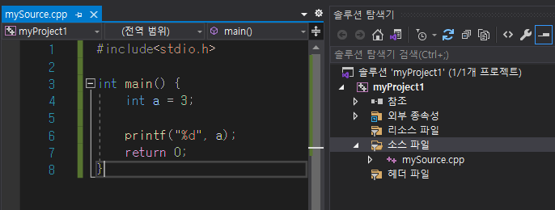

# visual studio 2019 git 연동하기
## 1. 프로젝트 생성

 

- 새 프로젝트 만들기(N)  

- 필요한 템플릿 선택

- 소스파일 생성
 

- 소스파일이 생성된 모습
  
****************************************************
## 2. git 연동

- 상단바의 Git(G) -> Git 리포지토리 만들기(G)...

- 리포지터리 이름(R) 지정
- 자신만 보기를 원할 경우 프라이빗 리포지토리(P) 체크

- github에 리포지토리가 생성된 모습

- 작성한 코드 확인

## 3. add, commit, push

- 상단바의 Git(G) -> 커밋 또는 스태시(C)

- commit 메세지 입력, 변경내용들 확인

- 모두 커밋 버튼을 누른 상태 add & commit 완료
- 발신할 수 있는 것이 1개 있는 것을 확인
  

- 상단바의 Git(G) -> 푸시(P)

- push 완료, 발신할 것이 없는 것을 확인

- 변경한 사항들이 적용된 모습

## 4. 사용자 간 conflict 시나리오 및 merge

- 유저1이 코드를 추가 후 push

- 유저1이 추가한 코드 확인

- 유저2가 유저1이 push한 것을 pull

- 유저2가 코드를 추가하여 push

- 유저1이 유저2가 push한 것을 pull하지 않고 코드 작성 후 push 시도

- pull을 하자 conflict 발생

- merge tool 실행, 자신의 코드와 pull이 되어 있던 코드 중에 선택

- 자신의 코드가 선택된 걸 볼 수 있다, push 진행

- push된 것을 확인

